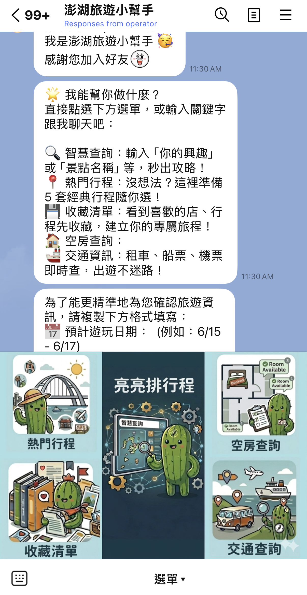

# 黃可嘉 (Kechia Huang)

- 學歷：國立政治大學 / 應用數學系雙主修統計系 大三在學中
- 地點：Taiwan
- 電子郵件：kejiahuang6@gmail.com
- 興趣方向：AI 應用、資料分析、社群經營
- 個人特質：外向、積極、適應力強、擅長團隊合作與時間管理

---

## 技能

  
  
  
  
  
  
  

---
## 關於我

我是黃可嘉，目前就讀國立政治大學應用數學系，並且雙主修統計學系。我的個性外向、積極，喜歡接觸新工具與解決問題，對 AI 應用、資料分析與數位服務開發有高度興趣。
雖然我並非資管或資工本科系出身，但我持續透過課堂學習、side project 與實習準備累積程式實作能力。我希望能將數學與統計訓練中的邏輯思維，結合程式開發與 AI 工具，做出真正能幫助使用者、且容易理解的應用服務。

---

## 工作經歷

### 趣遊網股份有限公司

-工作期間：2026/2/23 - Now  
-職位：AI專案實習生  
  本專案以 LINE 官方帳號作為媒介，打造一個結合 AI 智慧查詢、客製化行程生成、熱門行程推薦、收藏清單、空房查詢與交通查詢的「澎湖旅遊小幫手」。
  使用者加入好友後，可以透過聊天介面查詢推薦行程、住宿與交通資訊，也能輸入個人旅遊偏好，由系統協助生成符合需求的澎湖旅遊計畫。此服務希望提高旅客查找當地資訊與安排行程的效率，讓旅遊規劃更方便、直覺，也協助業者增加曝光與詢問機會。

#### 主要功能

- **熱門行程推薦**：提供澎湖熱門旅遊路線，協助使用者快速參考行程安排。
- **收藏清單**：使用者可將感興趣的景點、住宿或行程加入收藏，方便後續檢查與規劃。
- **亮亮排行程**：根據使用者輸入的需求或關鍵字，自動生成符合偏好的澎湖旅遊行程。
- **空房查詢**：協助查詢住宿相關資訊，包含入住日期、房型、價格與優惠內容。
- **交通查詢**：提供澎湖旅遊所需的交通資訊，例如飛機、船班、租借交通工具等。

#### 我的參與內容

- 協助規劃 AI 旅遊小幫手的功能架構與使用者流程
- 設計 LINE Bot 的選單功能與互動邏輯
- 整理澎湖旅遊、住宿與交通相關資料
- 協助製作專題海報，將專案概念、功能與流程視覺化呈現
- 思考如何透過 AI 降低使用者規劃旅遊行程的時間成本

#### 成品展示

### 寶工科學玩具

-工作期間：2023/12/5-2024/6/20  
-職位：第一屆校園大使  
  - 了解企業需求並透過各社群媒體協助行銷產品
  - 透過社群推廣並成功售出總價超過 2 萬元產品
  - 參與企業產品發表會，面對面向客戶介紹產品
---
## 專案經歷
### 小型 Transformer 是否也會學到 Factored Representations？
- 專案類型：AI / Machine Learning / Transformer 研究實作
- 專案連結：[Transformer研究](https://github.com/kechiahuang/factored)
- 專案介紹

生成式語言模型最基本的訓練原理是 next-token prediction，也就是在給定前文脈絡的情況下，讓模型學習預測下一個 token。過去研究指出，Transformer 可能不只是單純記憶 token 層級的模式，而是能夠分解輸入資料背後的潛在生成因子，並將不同因子表示在近似正交的子空間中。然而，原始研究使用的是相對完整的 Transformer 架構。因此，本專案希望探討：較小型且簡化的 Transformer 模型，是否仍然能展現類似的 factored representations。
根據結果顯示，在訓練過程中，hidden states 的有效維度會逐漸下降，並趨近於與 factored representations 相符的低維結構。此外，個別潛在因子的資訊也能從 hidden states 中被線性恢復，這表示即使是較小型且簡化的 Transformer，也可能透過 next-token prediction 學習到資料背後的潛在因子結構。

#### 主要內容

- 使用 Python 與 PyTorch 建立小型 Transformer language model
- 設計由多個 latent factors 組成的合成資料生成流程
- 訓練模型預測序列中的下一個 token
- 分析 hidden state 的有效維度變化
- 使用 PCA 視覺化不同 factor 在模型表示空間中的結構

### AI 小當家｜生成式 AI 食譜推薦系統

* 專案類型：Generative AI / API / Prompt Engineering
* 專案連結：[AI小當家](https://github.com/kechiahuang/Aichef)

本專案是一個結合生成式 AI 與食譜推薦的應用系統。使用者可以輸入自己的需求、心情或想使用的食材，系統會透過 AI 分析使用者狀態，並即時生成適合的菜餚與食譜。
在專案中，我設計 system prompt 讓模型能根據使用者情緒推薦相對應的食材，並使用 JSON 將生成結果結構化，方便後續轉換為 Python 物件進行處理。同時，我也加入狀態記錄機制，避免模型重複推薦相同菜名，讓使用者能獲得更多元的料理建議。

#### 主要內容

* 串接 API 生成菜餚與食譜內容
* 設計 system prompt，讓 AI 分析使用者情緒並推薦食材
* 使用 JSON 結構化 AI 回傳資訊
* 將 JSON 轉換為 Python 物件，提升資料處理穩定性
* 建立狀態記錄機制，避免重複推薦相同菜名

---

## 社團經歷

### 國立政治大學 數理資訊研究社｜美宣

- 負責海報製作與社群管理，提高社團曝光率與互動率
- 協助架設社團官網，提供版面與視覺設計建議
- 設計社團 Logo 與 3D 雷切活動周邊，提升活動收入與整體形象

### 政大指南服務團 德芙蘭分隊｜副隊長

- 帶領約 30 位團員至部落服務小朋友
- 負責團隊溝通、任務分工與現場協調
- 蒐集各組資料並彙整企劃書，協助取得總額約 10 萬元以上贊助

---

